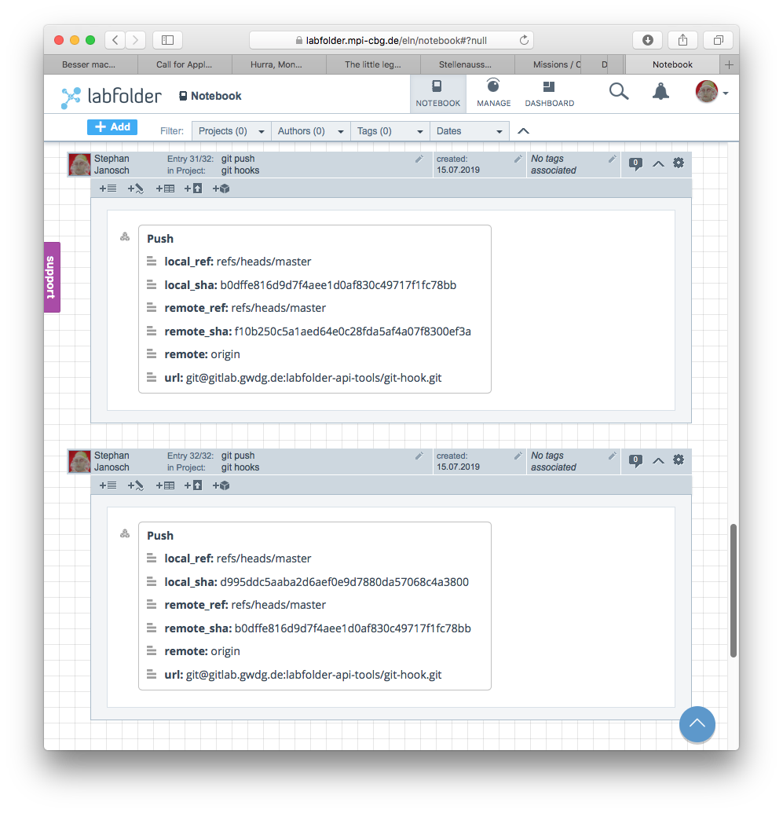

# git hook

## pre-push
a git hook creating a labfolder entry for each push.

Author: Stephan Janosch; janosch@mpi-cbg.de

command line dependencies: 
* curl
* jq

The hook will ask you for your labfolder password, in case it cannot find a valid token in `$HOME/.labfolder_token.sh` 
 which is being created during usage.

**note**: depending on your IDE you might not see the password prompt asking for your labfolder password.

Also 2 files are required:

#### $PROJECT_ROOT/projectId.sh
this files configures the Labfolder project ID where entries go.

The project id can be found in the url bar of your browser.


```bash
#!/bin/sh
PROJECTID=3358
```

#### ~/.labfolder_credentials.sh


```bash 
#!/bin/sh

USER='user'
LABFOLDER_HOST='labfolder.server.de'
```



